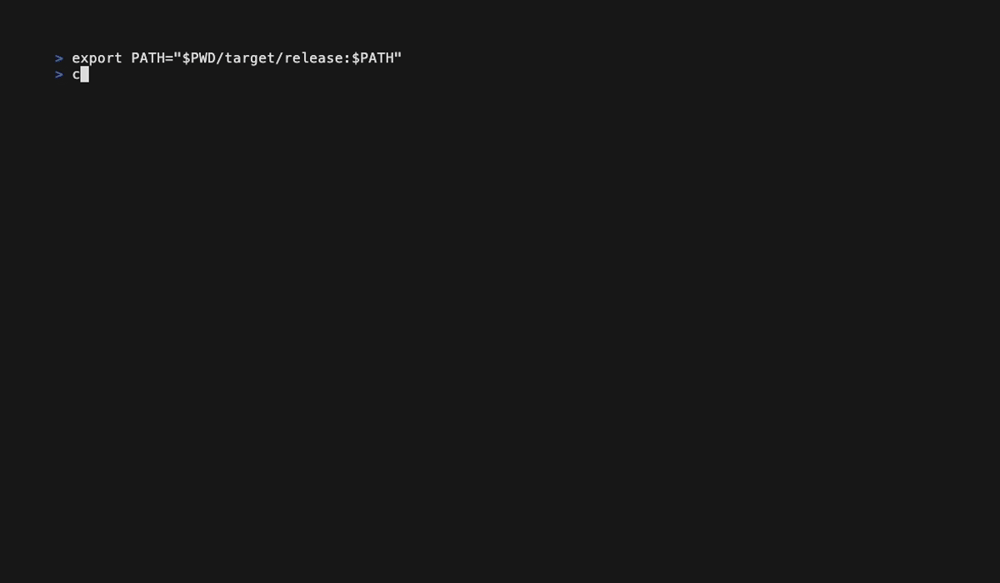
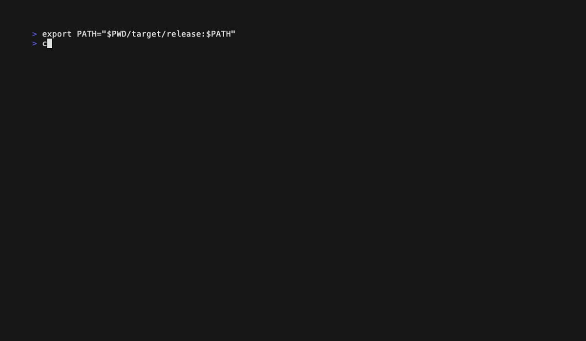
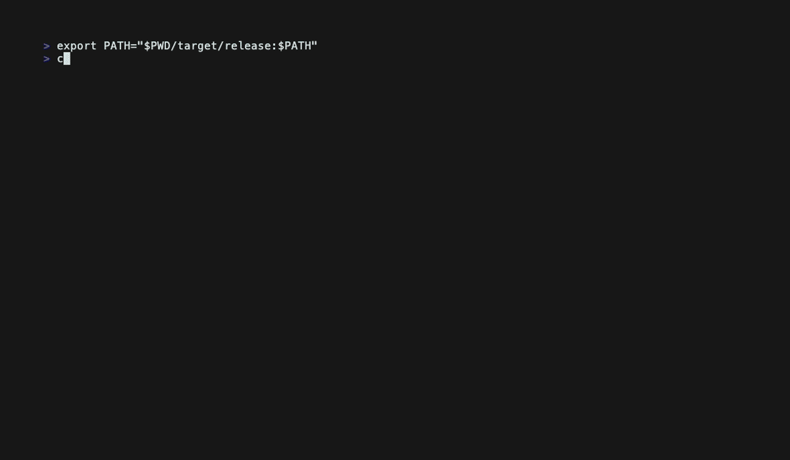
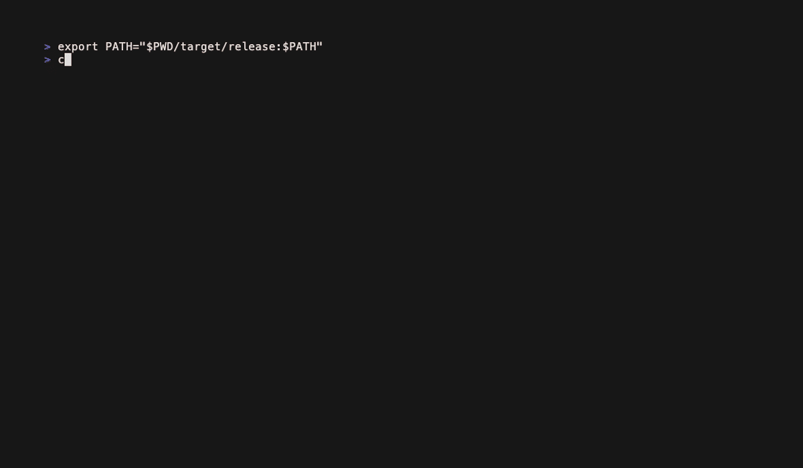
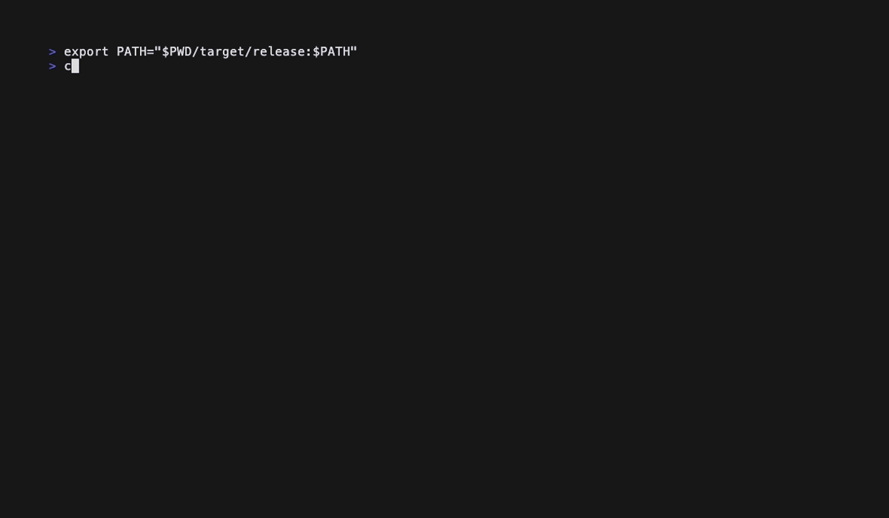

# chromashell

Live shader effects for your terminal. Wraps your working shell session with visual overlays — matrix rain, lightning storms, falling snow, aurora, and more. Your terminal stays fully usable while effects render around your text.

## Showcase

### Matrix


### Fire


### Rain


## Install

### Homebrew (macOS / Linux)

```bash
brew install leoditto/tap/chromashell
```

### Quick install (pre-built binary)

```bash
curl -sSf https://raw.githubusercontent.com/leoditto/chromashell/master/install.sh | sh
```

### Cargo

```bash
cargo install chromashell
```

### From source

```bash
git clone https://github.com/leoditto/chromashell
cd chromashell
cargo build --release
```

All methods install both `chromashell` and `cs` (shorthand) binaries.

## Usage

```bash
cs                        # random effect
cs matrix                 # specific effect
cs lightning -d 0.8       # adjust density (0.0 - 1.0)
cs fire --standalone      # effect only, no shell
cs --list                 # list all effects
cs --fps 60               # custom framerate
```

Press `Ctrl+\` to quit and return to your normal terminal.

## How it works

chromashell spawns a PTY (pseudo-terminal) wrapper around your `$SHELL`. It captures the shell output, feeds it to the selected effect as a text layer, and renders the combined result. Your keystrokes pass through to the shell — it's your normal terminal, just with effects.

## Options

```
Usage: cs [OPTIONS] [EFFECT]

Arguments:
  [EFFECT]  Effect to run (default: random)

Options:
  -d, --density <DENSITY>    Effect intensity 0.0-1.0
  -f, --file <FILE>          Text file to overlay (standalone mode)
      --standalone           Run effect only, no shell
  -l, --list                 List all effects
      --fps <FPS>            Target frames per second [default: 30]
      --duration <DURATION>  Auto-quit after N seconds
      --truecolor            Use 24-bit truecolor (default: 256-color)
  -h, --help                 Print help
  -V, --version              Print version
```

## Performance

All effects run well under 1% CPU and ~2 MB RAM.

| Effect | CPU | RAM |
|---|---|---|
| matrix | 0.4% | 1.9 MB |
| fire | 0.5% | 1.9 MB |
| rain | 0.4% | 1.9 MB |
| plasma | 0.4% | 1.9 MB |
| aurora | 0.4% | 1.9 MB |
| ocean | 0.5% | 1.9 MB |
| lightning | 0.5% | 1.9 MB |
| snow | 0.4% | 1.9 MB |
| autumn | 0.4% | 1.9 MB |
| fireflies | 0.4% | 1.9 MB |
| retro | 0.4% | 1.9 MB |
| galaxy | 0.4% | 1.9 MB |
| metaballs | 0.4% | 1.9 MB |

Measured at 30fps in a standard terminal on Apple Silicon.

## Requirements

- macOS or Linux
- Any terminal with 256-color support
- Any shell (zsh, bash, fish, etc.)

## All Effects

| Effect | Preview |
|---|---|
| `matrix` |  |
| `fire` |  |
| `rain` |  |
| `lightning` |  |
| `aurora` |  |
| `snow` |  |
| `autumn` |  |
| `fireflies` |  |
| `ocean` |  |
| `retro` |  |
| `plasma` |  |
| `galaxy` |  |
| `metaballs` |  |

## License

MIT
